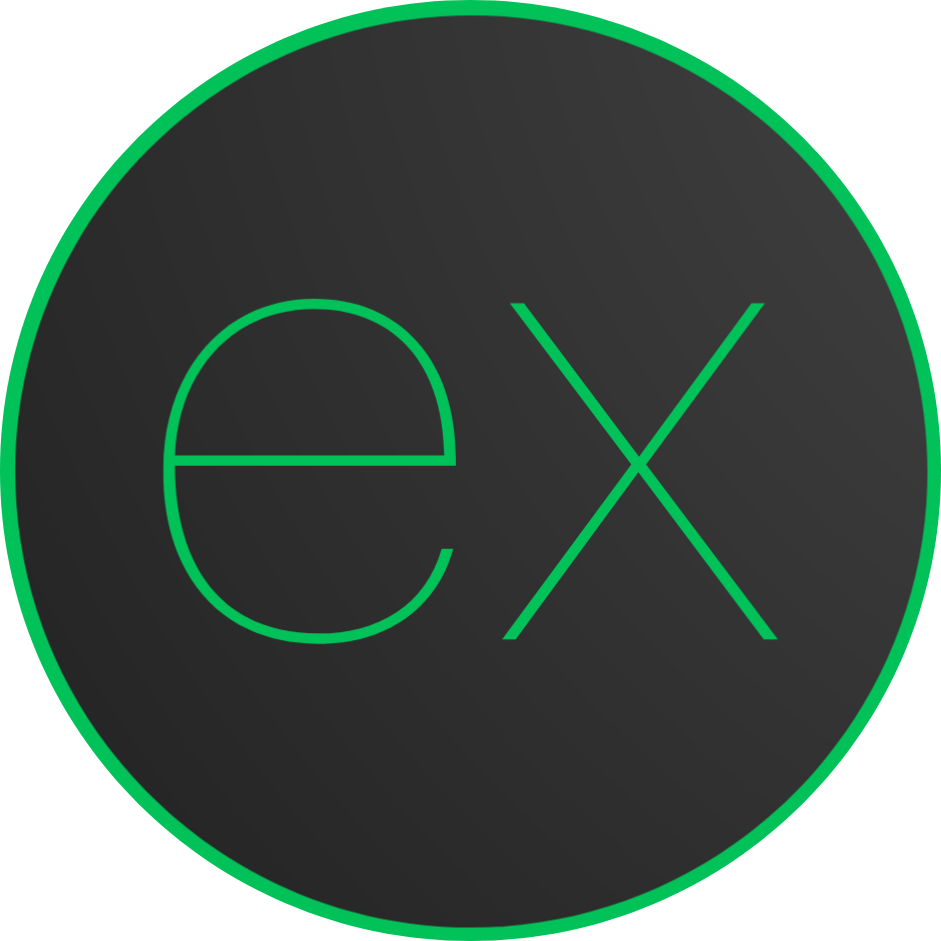

<p align="center">
  
</p>

<h1 align="center">Create Ex</h1>

<p align="center">
  Interactive CLI tool to bootstrap a modular typesafe Express API application.
</p>

## Table of Contents

- [Overview](#overview)
- [Getting Started](#getting-started)
- [Community](#community)
- [Contributing](#contributing)
- [License](#license)

## Overview

`create-ex` is designed to kickstart your Express projects with best practices built in. It consists of:

- **TypeScript**
- **Modular Structure:** Clear separation of routes, controllers, services, and more.
- **Optional Integrations:** Choose from Prisma (with multiple database support), Socket.IO, ESLint, and more.
- **Automated Setup:** Quickly initialize Git, install dependencies, and get started.

It's a CLI tool to streamline the setup of a modular Express API application. Every component is optional, and the final template is generated based on your specific needs.
We provide our recommendations for best practices, but ultimately, the decisions are yours.

## Getting Started

To create your new Express project, simply run one of these commands:

### npm

```bash
  npx create-ex@latest
```

### yarn

```bash
  yarn create ex
```

### pnpm

```bash
  pnpm create ex@latest
```

### bun

```bash
  bun create ex@latest
```

Follow the interactive prompts to choose your preferred boilerplate

## Community

We believe in building a supportive ecosystem. If you have questions or need help:

- [Open an issue](https://github.com/MoWael11/create-ex/issues/new) on our repository.

## Contributing

We welcome contributions to improve Create Express App! Please see our [CONTRIBUTING.md](https://github.com/MoWael11/create-ex/blob/main/CONTRIBUTING.md) for more details on how to get started.

## License

This project is licensed under the MIT License. See the [LICENSE](https://github.com/MoWael11/create-ex/blob/main/LICENSE) file for details.
